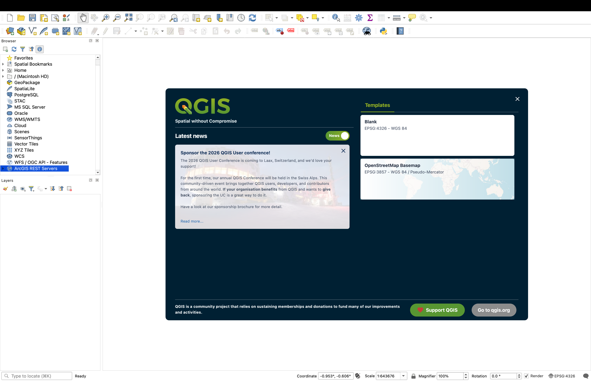
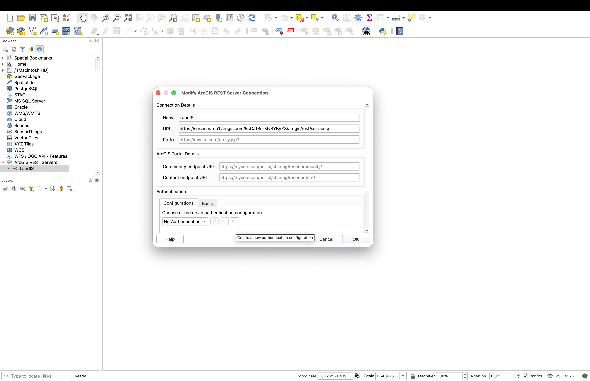
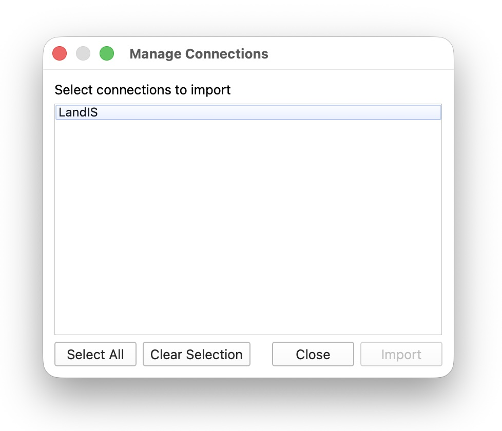
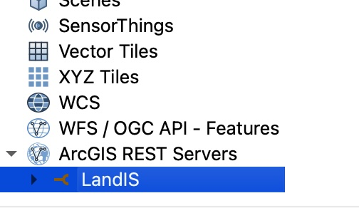
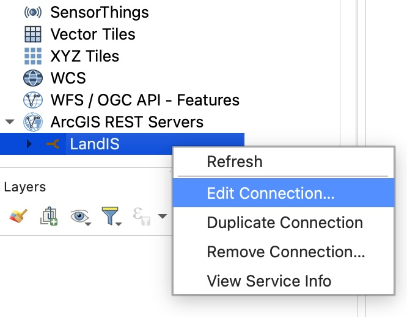
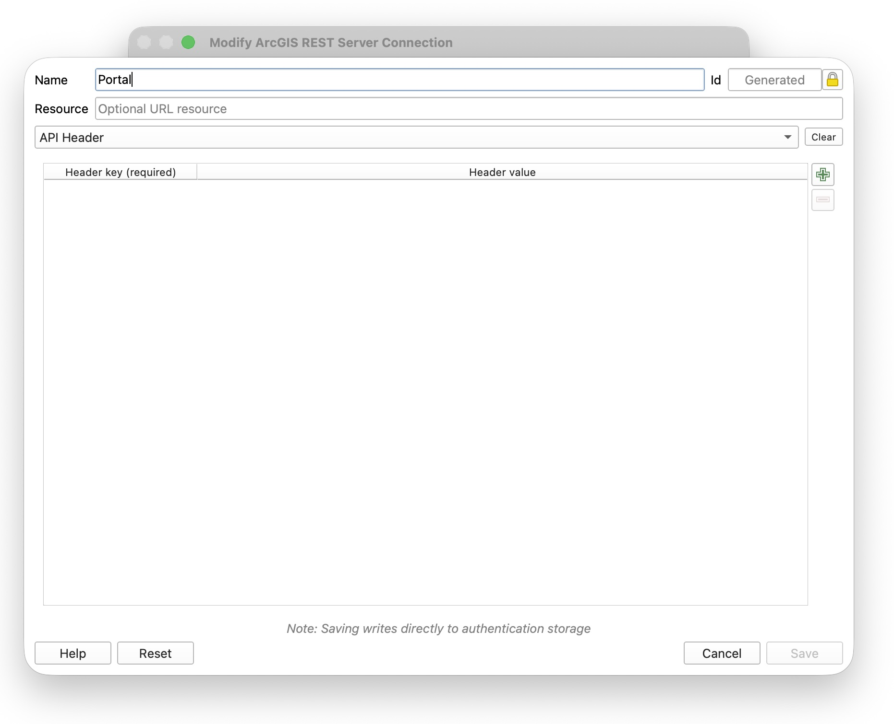
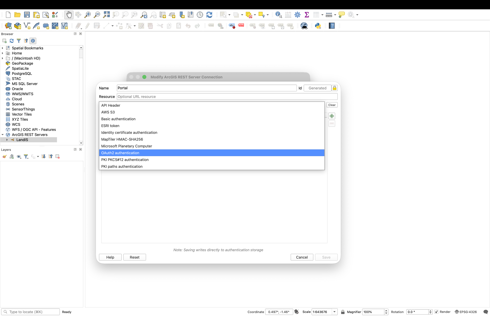
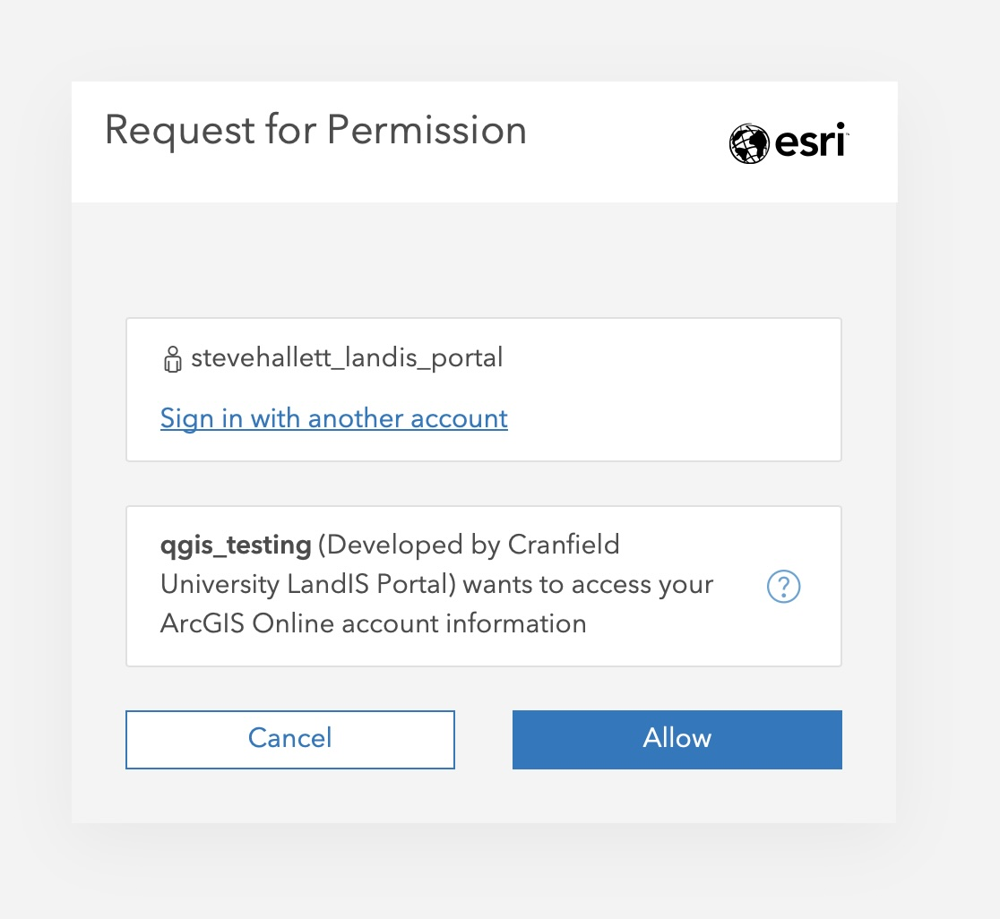
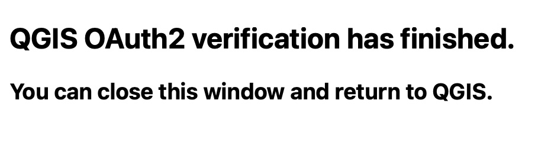

# LandIS — QGIS configuration files for ArcGIS Online

These files support the **LandIS Soil Portal** project. They are **configuration files for QGIS** that allow the desktop GIS application to connect to and use the soil data and map services exposed through the portal.

The portal itself is hosted on **ArcGIS Online** (AGOL). QGIS uses these service definitions access the hosted soils data content reliably from a local GIS workflow. You will be asked to authenticate yourself on the portal, for which you will need a free account as directed on the Portal.

An effective means to access the Portla data is through a REST service. THis way you can be sure you are always accessing the latest version of the data.

Portal link: [https://portal.landis.org.uk](https://portal.landis.org.uk)

## Contents

| File | Purpose |
|------|---------|
| `open_soil_REST.xml` | QGIS browser / connection metadata for the REST endpoint. |
| `qgis_OAuth2_config.json` | OAuth2 parameters for signing in to the ArcGIS Online organisation when QGIS requests layers or services. |

## Instructions

You will already have installed a copy of the latest QGIS open source GIS package. Full installation details are here [https://qgis.org/resources/installation-guide/](https://qgis.org/resources/installation-guide/).

First, ensure you have a free user account for the Portal. Be sure your computer is online on the Internet and the Soil Portal is accessible (e.g. test this by connecting to it first).

Next, download the two files attached here to your local computer.

Open QGIS, in the lefthand content browser panel, select the final option 'ArcGIS REST Servers'.

Right mouse click this and select 'Load Connections...'. Navigate to and select the file 'open_soil_REST.xml'.

In the box that appears, click on it to select the option 'LandIS' and then 'Import'.

Now, back in the left hand panel, double click on the final 'ArcGIS REST Servers' option and the 'LandIS' connection should appear.

Right mouse click on the LandIS connection and select 'Edit Connection...'

The modify Connection dialogue appears. You will now add your account authentication. Select the green '+' button at the bottom in the Authentication section.

In the resulting connection dialogue, first give the configuration a name - here we used 'Portal'. Then, in the drop down box below, select 'OAuth2 authentication'. You will now load in the connection file from this page.

Select the 'Inport configuration' button, and navigate to and select the 'qgis_OAuth_config.json' file. Without any further edits, select 'Save', the 'OK' to close the 'Modify ArcGIS REST Server Connection' dialogue.

As you do this, you will be directed to the 'Request for Permission' dialogue on the Soil Portal. Select 'Allow' and then Log in with your usual account details.

Note this will time out if you are not quick about this! If that happens, go back and select 'Refresh' on the connection to open the Portal page again.

A success message should appear. Yoiu can now close the Portal and go back to QGIS.

You should now see all the Soil Portal datasets listed. You can access and interact with these data in the usual way!

Note you can select the map data, the attributes and the metadata from each feature layer.

Tested with QGIS 4.0.0

## Author and date

**Professor Stephen Hallett**  
**31 March 2026**

## Licence

This work is licensed under the **Creative Commons Attribution-ShareAlike 4.0 International** (CC BY-SA 4.0) licence. You may share and adapt the material provided you give appropriate credit and distribute contributions under the same licence. See the [`LICENSE`](LICENSE) file for the full statement and a link to the legal text.

If you publish this repository publicly, treat any **credentials or secrets** in local copies of OAuth or service configuration as sensitive: rotate them if they are ever exposed, and avoid committing real secrets to a public branch.

## Acknowledgement

LandIS and the Soil Portal are part of the broader Land Information System context for soil information in Great Britain. This method was established by Dr Toby Waine of Cranfield University.
